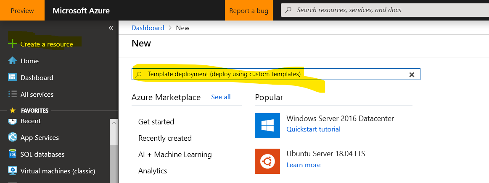
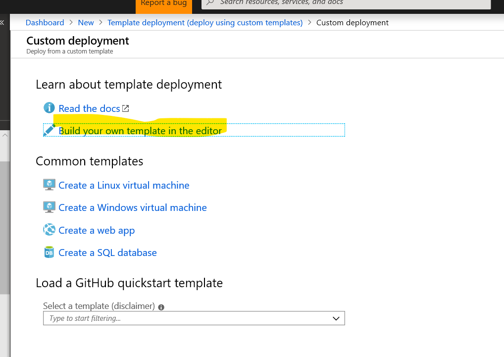
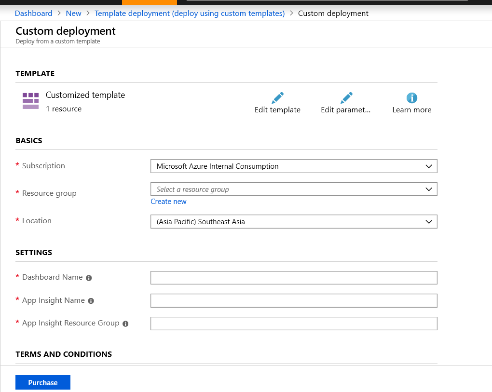
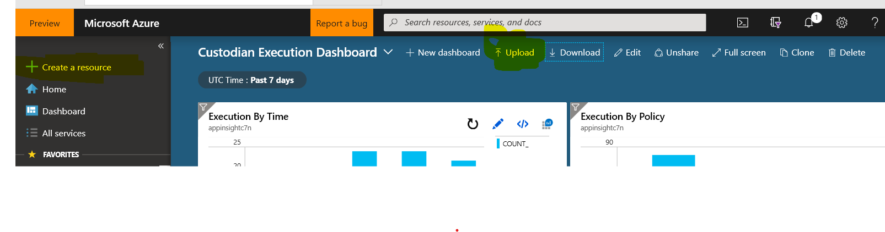

# Introduction
This guidance guides how to deploy custodian execution dashboard on an Azure subscription.

# Deploy from Azure CLI

Deploy new dashboard from template.json file
```
az group deployment create --resource-group <resource-group-name> --template-file template.json
```

# Deploy as custom template (Azure Portal)

Go to <b>Create a resource</b> and search for template deployment



Choose <b>Build your own template in the editor</b>



Copy template.json content and replace with content in editor, save it and deploy 

Create resource from template



# Upload file to create new dashboard 
Replace dashboard.json file with your Azure information
- Replace <b>DeployedSubscriptionId</b> with subscription id
- Replace <b>AppInsightResourceGroup</b> with the name of app insight resource group
- Replace <b>AppInsightName</b> with the name of app insight

Go to Azure Portal to Dashboard main page, click on Upload 



upload dashboard.json file which you have just updated above

New dashboard will be setting up....


